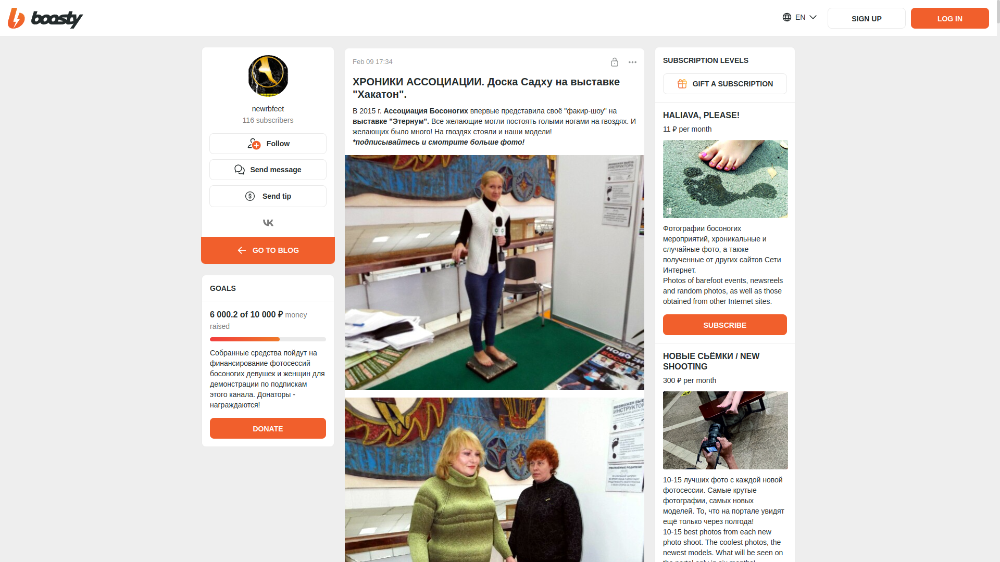

# boosty_save
Сохраняет картинки с постов на бусти

# Как пользоаться.

Скачиваем файл boosty_save.py 

Редактируем его

Запускаем!

# Что редактировать в файле?

Редактируем мы строчки под номером 90, 93, 97 и 102. 

90 и 93 строчки - нужны для куков. Как их получить читайте [тут](#получение-cookie-и-authorization). Куки нужны только в том случае если вы хотите скачать то что доступно только по подписке(подписка должна быть у вас). Если подписки нет или вы не вставили куки то скрипт может скачать только то что доступно всем!

97 строчка - список названий изображений которые скрипт будет игнорить. Это плашки для подписок. По этому поводу пишу [тут](#теория). Думаю поймете какие названия туда ставить надо. Просто название без формата. 

102 строчка - путь до папки куда скрипт все сохранит. Скрипт будет создавать в этой папке еще одну папку с названием поста!

80 строчку редачить можно если вы в себе уверены. Она отвечает за количество потоков для одновременного скачивания. 5 нормальное и быстрое значение. Лучше не редактировать если не знаете что к чему


### Получение Cookie и Authorization

- Перейдите на страницу boosty.to;
- Войдите в свой аккаунт на boosty.to;
- Нажмите клавишу `F12`;
- Перейдите в раздел Console (Консоль);
- В поле ввода консоли введите следующий код и нажмите Enter:

```
const full_cookie=`${document.cookie}`;function getCookie(o,e){const l=e.split(`; ${o}=`);if(2===l.length)return l.pop().split(";").shift()}function parseAuthCookie(o){if(void 0===o)return;let e=o.replaceAll("%7B","{");e=e.replaceAll("%22",'"'),e=e.replaceAll("%3A",":"),e=e.replaceAll("%2C",","),e=e.replaceAll("%7D","}");let l=JSON.parse(e).accessToken;return void 0!==l?"Bearer "+l:void 0}const auth_token=getCookie("auth",full_cookie);void 0===auth_token?console.log("Не получилось найти данные авторизации. Вы точно вошли в аккаунт?"):console.log(`\n\nCookie:\n\n${full_cookie}\n\nAuthorization:\n\n${parseAuthCookie(auth_token)}\n\n`);
```
**При вставке кода в консоль, браузер может показать предупреждение о вставке кода. В таком случае, перед вставкой кода, введите в консоль то, что просит браузер, например: "разрешить вставку", нажмите Enter, а уже потом выполняйте вставку кода и снова нажимайте Enter.**

- В консоли появится текст вида:

```
Cookie:

<То, что нужно вставить в поле session >

Authorization:

Bearer <То, что нужно вставить в поле authorization>
```

  
**Держите содержимое этих параметров в секрете!**

Если через какое-то время приложение перестало скачивать контент, попробуйте обновить значения полей по инструкции выше.


# Теория!

Пост в бусти выглядит так (скрин ниже). Ссылка на пост выглядит так: [https://boosty.to/newrbfeet/posts/cc7bcc22-9e23-4450-b54d-b139b56f3e9a](https://boosty.to/newrbfeet/posts/cc7bcc22-9e23-4450-b54d-b139b56f3e9a) 


И еще пример поста. Выглядит так(скрин ниже). Ссылка на пост выглядит так: [https://boosty.to/newrbfeet/posts/d0caca7a-858d-4526-a5b2-2b01e85d41b9](https://boosty.to/newrbfeet/posts/d0caca7a-858d-4526-a5b2-2b01e85d41b9)


Вот что мы получаем при запросе запросе к постам через реквестс и парсинге через бьютифулсоап


[файл_1](https://github.com/hinaichigo-fox/boosty_save/blob/main/theory/АНОНС_ИДУТ_СЪЁМКИ.html) [файл_2](https://github.com/hinaichigo-fox/boosty_save/blob/main/theory/ХРОНИКИ_АССОЦИАЦИИ.html)

Вот так выглядят оригиналы страниц:

 


А вот как выглядят страницы после реквеста и бьютифулсоап:

 


Как видим изменения видны. Но это важно для нас!

Фото получены. 

Скрипт просто берет ссылки на все фотографии которые есть на странице. И обрезает их чтобы получить максимальное качество! 

Зачем обрезать ссылки? 

Потому что бусти по умолчанию делает фото шакального качества. Пример ссылки на фото 
```
https://images.boosty.to/image/373be008-c8b6-4bfd-b1e2-c955045b5e06?change_time=1739111340&mw=575 
```
Как видим есть часть mw=575 которая и отвечает за качество. Прямая ссылка на фото выглядит так:
```
https://images.boosty.to/image/373be008-c8b6-4bfd-b1e2-c955045b5e06
```
Ее бот и сохраняет.

А зачем тогда список под названием block?

Потому что в полученных страницах есть такая штука как аватарка профиля и обложки подписок. Пример этому виден на скрине ниже(для наглядности оригинальная страница бусти и полученный ответ)

 


И эти картинки тоже бот скачивает. Чтобы этого избежать просто добавьте в блок названия этих картинок типа 373be008-c8b6-4bfd-b1e2-c955045b5e06 и все. На всем профиле картинки одни и те же так что больше они скачиваться не будут. 

# Пример работы

#### Без авторизации 

Имеем: пост доступный всем. https://boosty.to/newrbfeet/posts/cc7bcc22-9e23-4450-b54d-b139b56f3e9a 9 фото. Скрин ниже


Запускаем. Вводим ссылку. Скрипт сохраняет все файлы в высоком расширении!


#### С авторизацией

Имеем: пост доступный только по подписке. https://boosty.to/newrbfeet/posts/48f1314a-615e-4899-8578-56453bd2db4a 10 фото. Скрин ниже


Добавляем куки в скрипт! Запускаем. Вводим ссылку. Скрипт сохраняет все файлы в высоком расширении!


# Спасибо за внимнаие!
